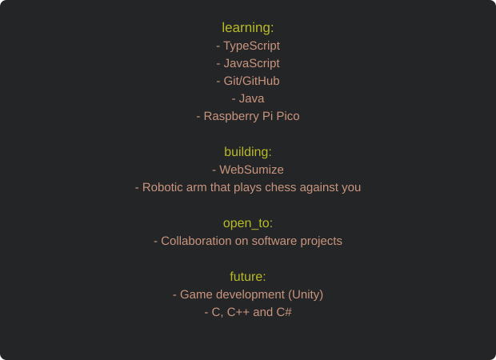

 </a>

 

   

---

## About

  

    
    
  

  <small>Updates every 2-7 minutes (Ctrl + Shift + R)</small>

 

Hi, I'm Alexander (he/him), a student at a higher technical school for IT. At the moment I'm working on [WebSumize](https://github.com/Alexius2408/WebSumize), an Electron app built with JavaScript, HTML and CSS. I really enjoy building small projects on the side. Outside of coding I'm usually swimming or snorkeling, bouldering, ski, snowboarding or playing video games. I also like listening to music.

## Tech Stack

### Languages

  

### Web &amp; Data

### Electronics

### IDEs

  

---

 

# Featured Projects

 

<h1 style="border-bottom: none;">WebSumize</h1>

 

  

  

WebSumize is a small desktop app that makes it easier to view information from WebUntis.

Instead of opening the WebUntis website every time, it shows the most important information in one place.

<b>Project Details</b>

 

| | |
| :-- | :-- |
| **Built With** | Electron, HTML, JavaScript, CSS |
| **Function** | Gets WebUntis data and displays it in a good-looking way |
| **Highlights** | Many parts of the interface can be customized |
| **Status** | In progress |
| **Repo** | [github.com/Alexius2408/WebSumize](https://github.com/Alexius2408/WebSumize) |

 
 

---

 

<h1 style="border-bottom: none;">Nexus</h1>

 

  

  

Nexus is a messaging service that two friends and I developed for our 2025/26 school project.

It connects to our school server to retrieve and send messages in real time.

<b>Project Details</b>

 

| | |
| :-- | :-- |
| **Built With** | HTML, JavaScript, CSS |
| **Purpose** | Gets and sends messages and lets users create new chat rooms |
| **Highlights** | Your messages look different from others and users can have separate accounts |
| **Status** | Archived |
| **Repo** | [github.com/Alexius2408/Nexus](https://github.com/Alexius2408/Nexus) |

 
 

---

 

<h1 style="border-bottom: none;">DEMISE</h1>

  

  

  

DEMISE is a 3D shooter built with Python, Pygame, and PyOpenGL.

The player fights through waves of enemies, manages weapons, and tries to survive as long as possible. Our goal was to create everything ourselves, including all 3D models, graphics, and sounds.

<b>Project Details</b>

 

| | |
| :-- | :-- |
| **Built With** | Python, Pygame, PyOpenGL |
| **Function** | Wave-based 3D shooter |
| **Highlights** | Creating a 3D environment using Pygame and PyOpenGL |
| **Assets** | All 3D models, graphics, and sounds were created by us |
| **Status** | Archived |
| **Repo** | [github.com/Alexius2408/DEMISE](https://github.com/Alexius2408/DEMISE) |

 
 

---

## GitHub Analytics

 

  

---

## Contribution

<picture>
  <source media="(prefers-color-scheme: dark)" srcset="https://raw.githubusercontent.com/Alexius2408/Alexius2408/output/github-contribution-grid-snake-dark.svg" />
  <source media="(prefers-color-scheme: light)" srcset="https://raw.githubusercontent.com/Alexius2408/Alexius2408/output/github-contribution-grid-snake.svg" />
  
</picture>

---

## Current Focus

  

  

---

## Links

  

<!-- https://cron-job.org -->